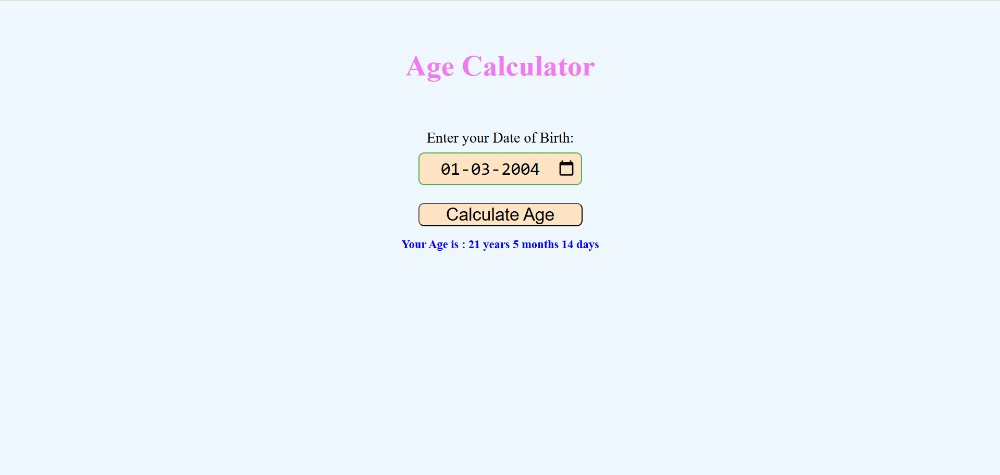

# 🎂 Age Calculator  

A simple and interactive **Age Calculator** built with **HTML, CSS, and JavaScript**.  
Enter your date of birth and instantly get your **exact age in years, months, and days**.  

  
  
  

---

## 📑 Table of Contents  
- [Features](#-features)  
- [How It Works](#-how-it-works)  
- [Project Structure](#-project-structure)  
- [Demo Screenshot](#-demo-screenshot)  
- [Technologies Used](#-technologies-used)  
- [Installation / How to Run Locally](#-installation--how-to-run-locally)  


---

## ✨ Features  
- Clean and easy-to-use interface  
- Calculates age in years, months, and days  
- Handles invalid inputs gracefully  
- Works instantly in the browser  

---

## 🛠 How It Works  
1. Enter your **Date of Birth** in the input field.  
2. Click the **Calculate Age** button.  
3. The app will display your exact age with year, month, and day details.  

---

## 📂 Project Structure  
```
AgeCalculator/
│── AgeCalculator.html # Main HTML file
│── AgeCalculator.css # Styling
│── AgeCalculator.js # Age calculation logic
│── AgeCalculator.png # Demo screenshot
│── README.md # Project documentation
```


---

## 📸 Demo Screenshot  
Here is a screenshot of the project running in the browser:  

  

---

## 💻 Technologies Used  
- **HTML5** → Structure of the app  
- **CSS3** → Styling and design  
- **JavaScript (ES6)** → Logic for age calculation  

---

## 🚀 Installation / How to Run Locally  
To run this project locally:  


```bash
# Clone the repository
git clone https://github.com/your-username/AgeCalculator.git 

# Open the project folder
cd AgeCalculator  
 

# Run in your browser
open age.html  
Or simply double-click age.html to open it in your browser.
