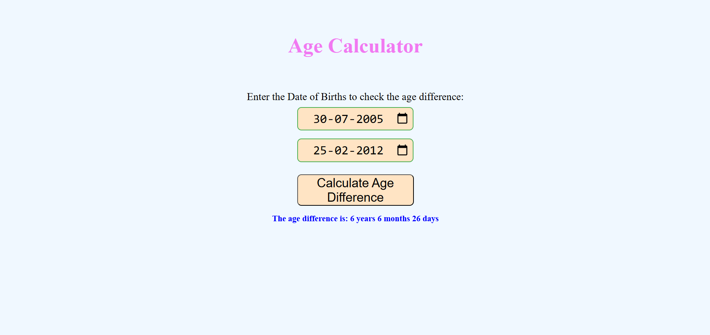

# 🔢 Age Difference Calculator  

A simple and interactive **Age Difference Calculator** built with **HTML, CSS, and JavaScript**.  
Enter two dates of birth and instantly get the **exact difference in years, months, and days**.  

  
  
  

---

## 📑 Table of Contents  
- [Features](#-features)  
- [How It Works](#-how-it-works)  
- [Project Structure](#-project-structure)  
- [Demo Screenshot](#-demo-screenshot)  
- [Technologies Used](#-technologies-used)  
- [Installation / How to Run Locally](#-installation--how-to-run-locally)  

---

## ✨ Features  
- Clean and user-friendly interface  
- Calculates the **exact difference** between two dates in years, months, and days  
- Handles invalid or missing inputs gracefully  
- Works instantly in the browser  

---

## 🛠 How It Works  
1. Enter two **dates of birth** in the input fields.  
2. Click the **Calculate Age Difference** button.  
3. The app will display the **exact difference** in years, months, and days.  

---

## 📂 Project Structure  

```
AgeDifferenceCalculator/
│── AgeDifferenceCalculator.html # Main HTML file
│── AgeDifferenceCalculator.css # Styling
│── AgeDifferenceCalculator.js # Age difference logic
│── AgeDifferenceCalculator.png # Demo screenshot
│── README.md # Project documentation

```
---

## 📸 Demo Screenshot  
Here is a screenshot of the project running in the browser:  

  


---

## 💻 Technologies Used  
- **HTML5** → Structure of the app  
- **CSS3** → Styling and design  
- **JavaScript (ES6)** → Logic for date difference calculation  

---

## 🚀 Installation / How to Run Locally  
To run this project locally:  

```bash
# Clone the repository
git clone https://github.com/your-username/AgeDifferenceCalculator.git  

# Open the project folder
cd AgeDifferenceCalculator  

# Run in your browser
open AgeDifferenceCalculator.html  
# Or simply double-click the file to open it
