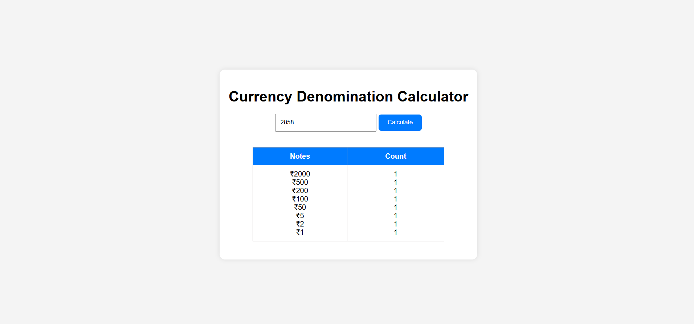

# 💰 Currency Denomination Calculator  

A simple and interactive **Currency Denomination Calculator** built with **HTML, CSS, and JavaScript**.  
Enter any amount and instantly get the **minimum number of Indian currency notes and coins** required.  

  
  
  

---

## 📑 Table of Contents  
- [Features](#-features)  
- [How It Works](#-how-it-works)  
- [Project Structure](#-project-structure)  
- [Demo Screenshot](#-demo-screenshot)  
- [Technologies Used](#-technologies-used)  
- [Installation / How to Run Locally](#-installation--how-to-run-locally)  

---

## ✨ Features  
- Clean and simple interface  
- Breaks amount into Indian currency notes & coins  
- Denominations used:  
  - ₹2000, ₹500, ₹200, ₹100, ₹50, ₹20, ₹10, ₹5, ₹2, ₹1  
- Handles invalid inputs gracefully  
- Works instantly in the browser  

---

## 🛠 How It Works  
1. Enter an **amount** in the input field.  
2. Click the **Calculate** button.  
3. The app will display a **clear breakdown of denominations** and their counts.  

---

## 📂 Project Structure  
```
Denominations/
│── Denomination.html # Main HTML file
│── Denomination.css # Styling
│── Denomination.js # Calculation logic
│── Denomination.png # Demo screenshot
│── README.md # Project documentation

```

---

## 📸 Demo Screenshot  
Here is a screenshot of the project running in the browser:  

  

---

## 💻 Technologies Used  
- **HTML5** → Structure of the app  
- **CSS3** → Styling and design  
- **JavaScript (ES6)** → Denomination calculation logic  

---

## 🚀 Installation / How to Run Locally  
To run this project locally:  

```bash
# Clone the repository
git clone https://github.com/your-username/Currency-Denomination-Calculator.git  

# Open the project folder
cd Currency-Denomination-Calculator  

# Run in your browser
open Denomination.html  
# Or simply double-click Denomination.html
