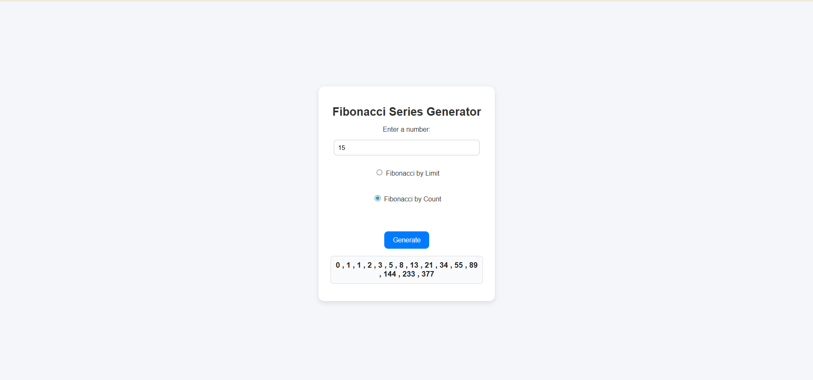

# 🔢 Fibonacci Series Generator  

A simple and interactive **Fibonacci Generator** built with **HTML, CSS, and JavaScript**.  
Choose between **Fibonacci by Limit** (all numbers below a given limit) or **Fibonacci by Count** (exact number of terms).  

  
  
  

---

## 📑 Table of Contents  
- [Features](#-features)  
- [How It Works](#-how-it-works)  
- [Project Structure](#-project-structure)  
- [Demo Screenshot](#-demo-screenshot)  
- [Technologies Used](#-technologies-used)  
- [Installation / How to Run Locally](#-installation--how-to-run-locally)  

---

## ✨ Features  
- Clean and user-friendly interface  
- Two modes:  
  - **By Limit** → Generates Fibonacci numbers less than `n`  
  - **By Count** → Generates exactly `n` terms  
- Instant results displayed in the browser  
- Simple and responsive design  

---

## 🛠 How It Works  
1. Enter a **number** in the input field.  
2. Select either **Fibonacci by Limit** or **Fibonacci by Count**.  
3. Click the **Generate** button.  
4. The app displays the Fibonacci series below.  

---

## 📂 Project Structure  
**Fibonacci by Limit**

---
**Fibonacci by Count**



```

FibonacciGenerator/
│── index.html # Main HTML file
│── style.css # Styling
│── fibonacci.js # Fibonacci logic
│── screenshot.png # Demo screenshot
│── README.md # Project documentation

```


---

## 📸 Demo Screenshot  
Here is a screenshot of the project running in the browser:  

  

---

## 💻 Technologies Used  
- **HTML5** → Structure of the app  
- **CSS3** → Styling and layout  
- **JavaScript (ES6)** → Fibonacci generation logic  

---

## 🚀 Installation / How to Run Locally  
To run this project locally:  

```bash
# Clone the repository
git clone https://github.com/your-username/Fibonacci.git 

# Open the project folder
cd Fibonacci 

# Run in your browser
open Fibonacci.html  
# Or simply double-click index.html to open it in your browser
