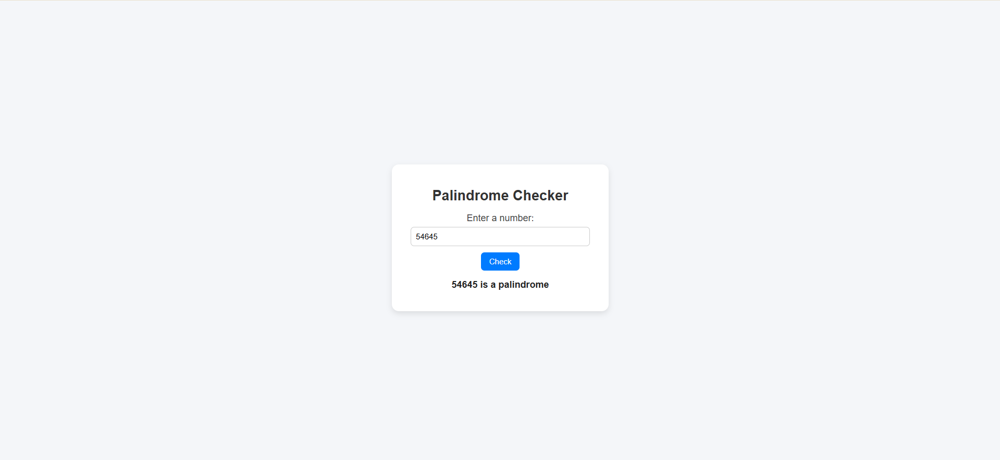

# 🔄 Palindrome Checker  

A simple **Palindrome Checker** built with **HTML, CSS, and JavaScript**.  
Enter a number in the prompt, and the app will check if it is a **palindrome** or not.  

  
  
  

---

## 📑 Table of Contents  
- [Features](#-features)  
- [How It Works](#-how-it-works)  
- [Project Structure](#-project-structure)  
- [Demo Screenshot](#-demo-screenshot)  
- [Technologies Used](#-technologies-used)  
- [Installation / How to Run Locally](#-installation--how-to-run-locally)  

---

## ✨ Features  
- Checks if a number is a palindrome  
- Displays result directly on the page  
- Very simple and beginner-friendly  
- Uses plain JavaScript logic  

---

## 🛠 How It Works  
1. Open the project in your browser.  
2. Enter a number when prompted.  
3. The app checks if the number reads the same forwards and backwards.  
4. Displays whether it’s a palindrome or not.  

---

## 📂 Project Structure  
```

PalindromeChecker/
│── index.html # Main HTML file
│── style.css # Styling
│── script.js # Palindrome checking logic
│── screenshot.png # Demo screenshot (optional)
│── README.md # Project documentation

```


---

## 📸 Demo Screenshot  
Here is a screenshot of the project running in the browser:  

  

---

## 💻 Technologies Used  
- **HTML5** → Structure of the app  
- **CSS3** → Styling and design  
- **JavaScript (ES6)** → Logic for palindrome check  

---

## 🚀 Installation / How to Run Locally  
To run this project locally:  

```bash
# Clone the repository
git clone https://github.com/your-username/PalindromeChecker.git  

# Open the project folder
cd PalindromeChecker  

# Run in your browser
open index.html  
# Or simply double-click index.html to open it in your browser
