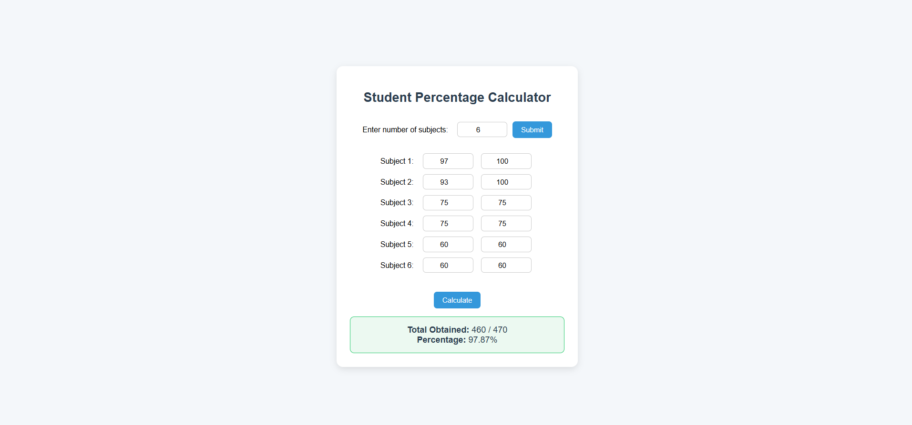

# 📘 Student Percentage Calculator  

A simple and interactive **Student Percentage Calculator** built with **HTML, CSS, and JavaScript**.  
It allows students to enter marks for **any number of subjects** (with different maximum marks per subject) and instantly calculates their **total marks** and **percentage**.  

---

## 📑 Table of Contents  
- [Features](#-features)  
- [How It Works](#-how-it-works)  
- [Project Structure](#-project-structure)  
- [Demo Screenshot](#-demo-screenshot)  
- [Technologies Used](#-technologies-used)  
- [Installation / How to Run Locally](#-installation--how-to-run-locally)  

---

## ✨ Features  
- Enter **any number of subjects**.  
- Input both **obtained marks** and **maximum marks** for each subject.  
- Automatically calculates:  
  - ✅ Total obtained marks  
  - ✅ Total maximum marks  
  - ✅ Final percentage  
- Neat and user-friendly interface.  
- Responsive design, works in any browser.  

---

## 🛠 How It Works  
1. Enter the **number of subjects**.  
2. Input marks obtained and maximum marks for each subject.  
3. Click **Calculate**.  
4. The app displays:  
   - Total obtained marks  
   - Total maximum marks  
   - Overall percentage  

---

## 📂 Project Structure  
```

PercentageCalculator/
│── PercentageCalculator.html # Main HTML file
│── PercentageCalculator.css # Styling (UI design)
│── PercentageCalculator.js # Logic for percentage calculation
│── PercentageCalculator.png # Demo screenshot
│── README.md # Project documentation

```


---

## 📸 Demo Screenshot  
Here is a screenshot of the project running in the browser:  

  

---

## 💻 Technologies Used  
- **HTML5** → Structure of the app  
- **CSS3** → Styling and design  
- **JavaScript (ES6)** → Logic for percentage calculation  

---

## 🚀 Installation / How to Run Locally  
To run this project locally:  

```bash
# Clone the repository
git clone https://github.com/your-username/StudentPercentageCalculator.git  

# Open the project folder
cd StudentPercentageCalculator  

# Run in your browser
open index.html  
# Or simply double-click index.html

