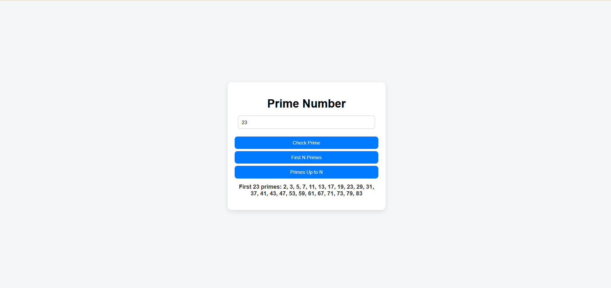
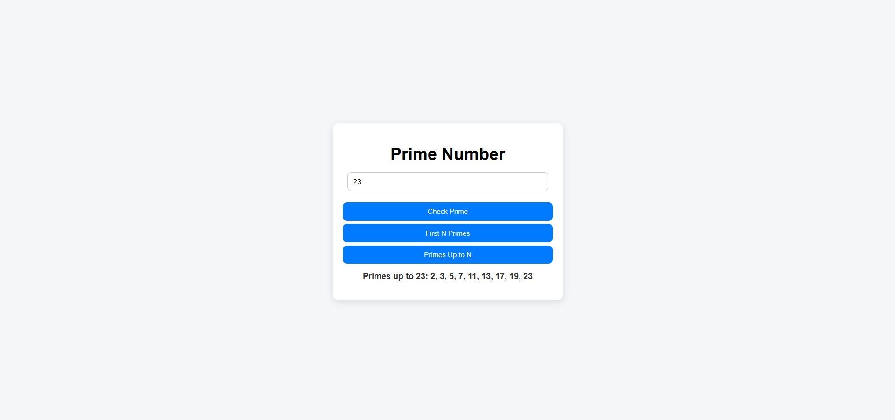

# 🔢 Prime Numbers Finder  

A simple and interactive **Prime Numbers Finder** built with **HTML, CSS, and JavaScript**.  
It allows users to:  
- Check whether a number is **prime or not**  
- Generate the **first N prime numbers**  
- List all **prime numbers up to a given number**  

  
  
  

---

## 📑 Table of Contents  
- [Features](#-features)  
- [How It Works](#-how-it-works)  
- [Project Structure](#-project-structure)  
- [Demo Screenshot](#-demo-screenshot)  
- [Technologies Used](#-technologies-used)  
- [Installation / How to Run Locally](#-installation--how-to-run-locally)  

---

## ✨ Features  
- Check **if a number is prime**  
- Generate the **first N prime numbers**  
- Generate all **prime numbers up to a given number** 
- Clean and interactive UI with styling  
- Works instantly in the browser  

---

## 🛠 How It Works  
1. Enter a number in the input field.  
2. Choose what you want to do:  
   - Check if the number is **prime or not**  
   - Generate the **first N prime numbers**  
   - Generate all **prime numbers up to that number**  
3. The app displays the result instantly.  

---

## 📂 Project Structure  
```
PrimeNumbers/
│── PrimeNumber.html # Main HTML file
│── PrimeNumber.css # Styling
│── PrimeNumber.js # Prime number logics
│── CheckPrime.png # Demo screenshot for checking a number is prime or not
│── FirstNPrimes.png # Demo screenshot for first N prime numbers
│── PrimesUptoN.png # Demo screenshot for Primes Up to N
│── README.md # Project documentation

```


---

## 📸 Demo Screenshot  
Here is a screenshot of the project running in the browser:  

  
 
 

---

## 💻 Technologies Used  
- **HTML5** → Structure of the app  
- **CSS3** → Styling and design  
- **JavaScript (ES6)** → Prime number logics  

---

## 🚀 Installation / How to Run Locally  
To run this project locally:  

```bash
# Clone the repository
git clone https://github.com/your-username/PrimeNumbers.git  

# Open the project folder
cd PrimeNumbers  

# Run in your browser
open PrimeNumbers.html  
# Or simply double-click PrimeNumbers.html to open it in your browser
