# 🎉 JavaScript Mini Projects 🚀  

Welcome to **JavaScript Mini Projects**!  
This repository contains a collection of small but powerful **beginner-friendly projects** built with **HTML, CSS, and JavaScript**.  

Each project is designed to:  
- Strengthen **logic-building** and **problem-solving** skills.  
- Practice **core web development** concepts.  
- Provide a hands-on way to learn JavaScript fundamentals.  

  
  
  

---

## 📋 Table of Contents  
- [✨ Features](#-features)  
- [📂 Project List](#-project-list)  
- [💻 Technologies Used](#-technologies-used)  
- [🛠️ Installation](#️-installation)  
- [🚀 Usage](#-usage)  
- [📁 Project Structure](#-project-structure)  
- [🧪 Testing](#-testing)  
- [🤝 Contributing](#-contributing)  
- [👨‍💻 Author](#-author)  

---

## ✨ Features  
✅ Beginner-friendly projects  
✅ Pure **HTML, CSS, JavaScript** – no external libraries  
✅ Each project includes a **README.md** + **preview image(s)**  
✅ Great for **learning, practice, and portfolio**  
✅ Covers key **logic-building concepts**  

---

## 📂 Project List  

Each project has its own folder with code and screenshots:  

| Project | Description | Preview |  
|---------|-------------|---------|  
| 📅 [Age Calculator](./AgeCalculator) | Calculate **exact age** in years, months, and days | 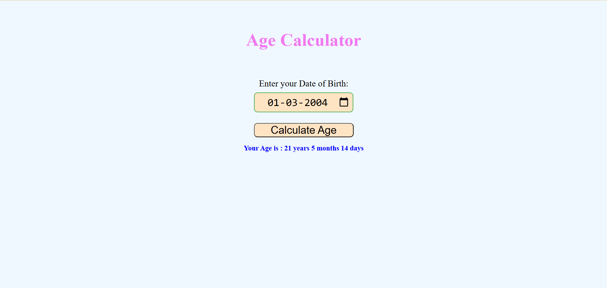 |  
| ⏳ [Age Difference Calculator](./AgeDifferenceCalculator) | Find **difference between two dates** | 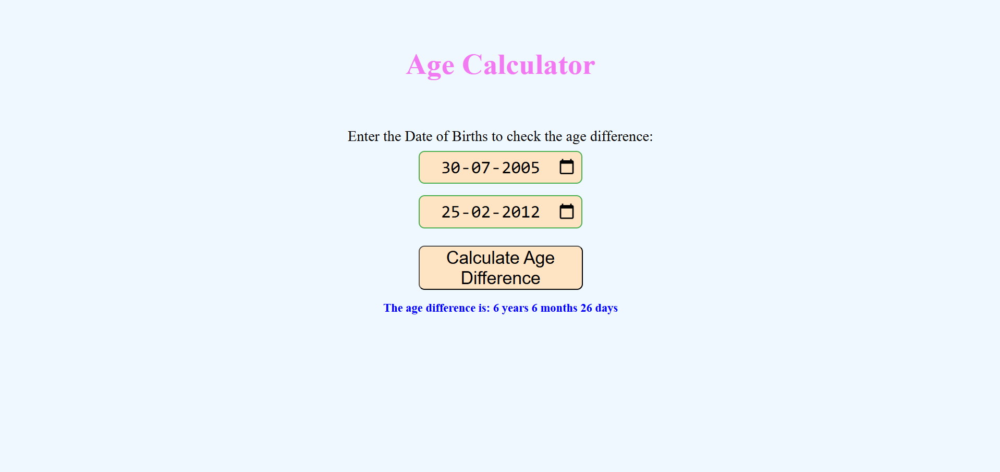 |  
| 🔢 [Armstrong Number Checker](./ArmstrongNumber) | Check if a number is an **Armstrong number** | 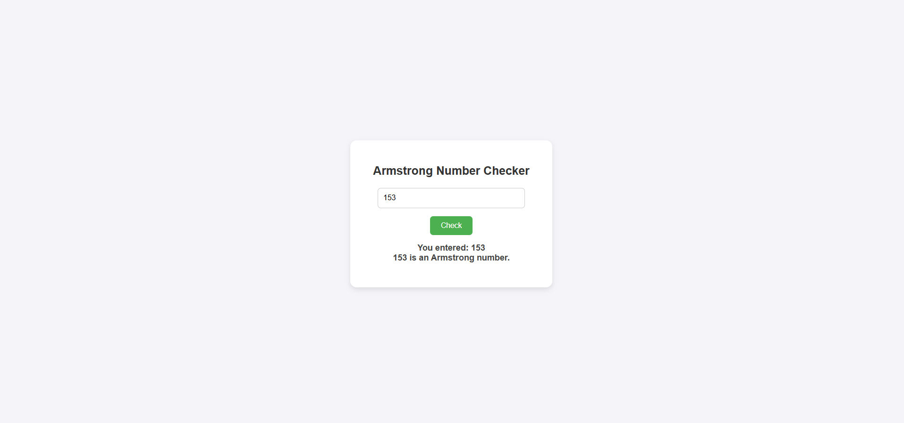 |  
| ⚖️ [BMI Calculator](./BMIcalculator) | Compute **Body Mass Index (BMI)** | 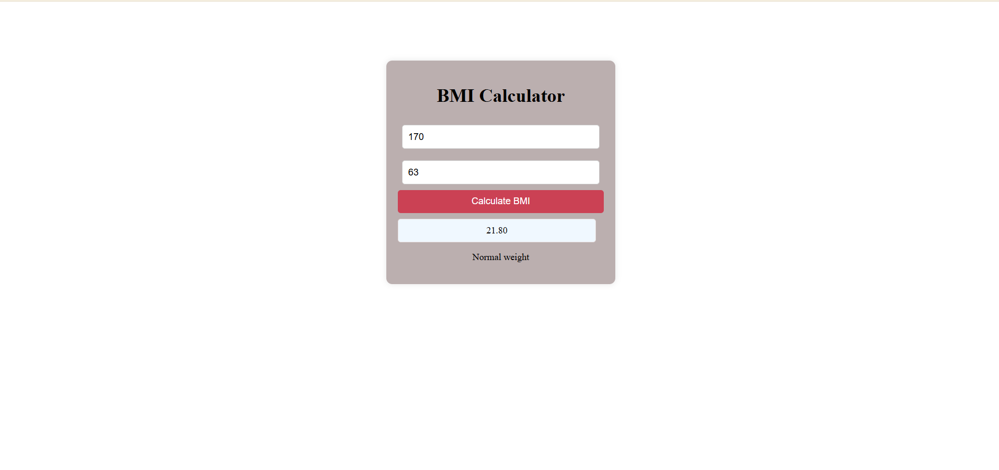 |  
| 📆 [Calendar](./Calender) | A simple **dynamic calendar** |  |  
| 💵 [Denominations Calculator](./Denominations) | Break down amount into **currency denominations** |  |  
| ⏰ [Digital Clock](./DigitalClock) | Real-time **digital clock** |  |  
| 📏 [Distance Converter](./DistanceConverter) | Convert **km ↔ m ↔ miles** | 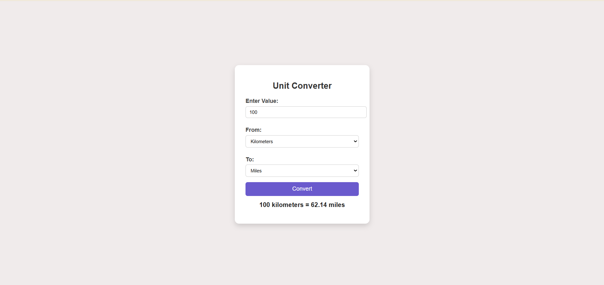 |  
| ✖️ [Factorial Calculator](./Factorial) | Find the **factorial** of a number |  |  
| 🔁 [Fibonacci Generator](./Fibonacci) | Generate the **Fibonacci sequence** | 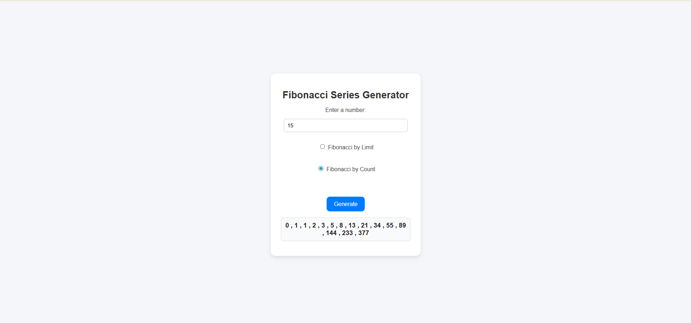 |  
| 🔄 [Palindrome Checker](./PalindromeChecker) | Test if input is a **palindrome** | 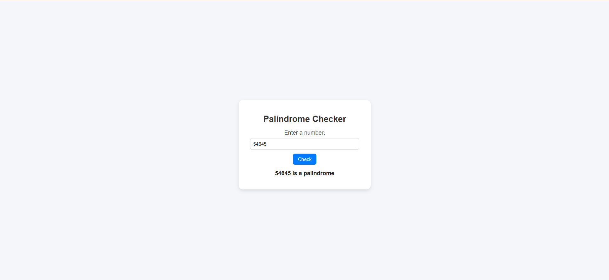 |  
| 📊 [Percentage Calculator](./PercentageCalculator) | Calculate **percentage values** |  |  
| 🔢 [Prime Number Checker](./PrimeNumber) | Check if number is **prime** | 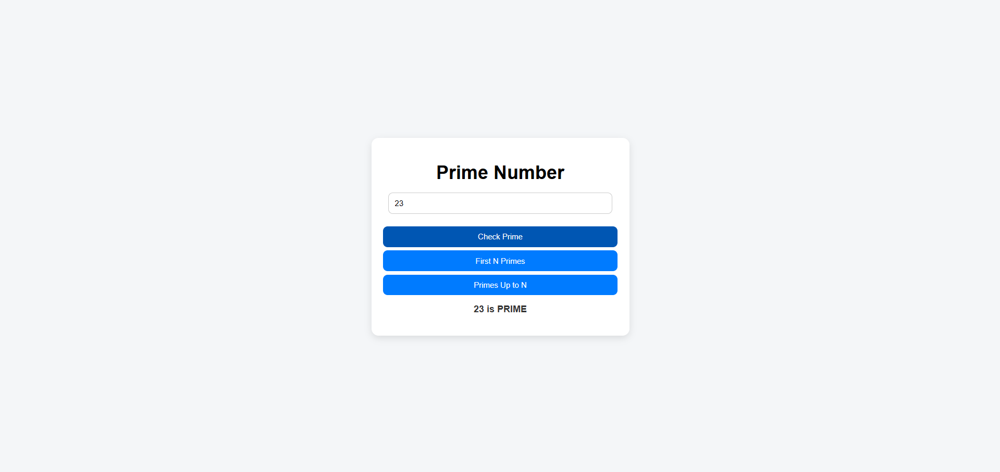 |  
| 📝 [Text Area Counter](./TextAreaCounter) | Count **characters & words** | 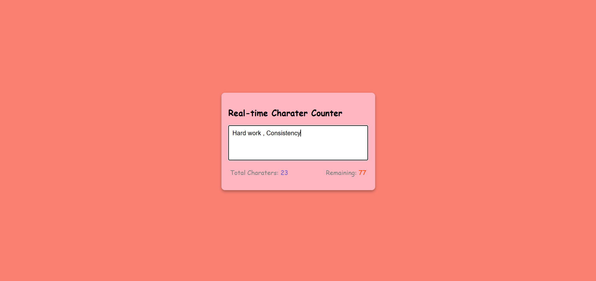 |  
| 💰 [Tip Calculator](./TipCalculator) | Calculate **tip amount & total bill** | 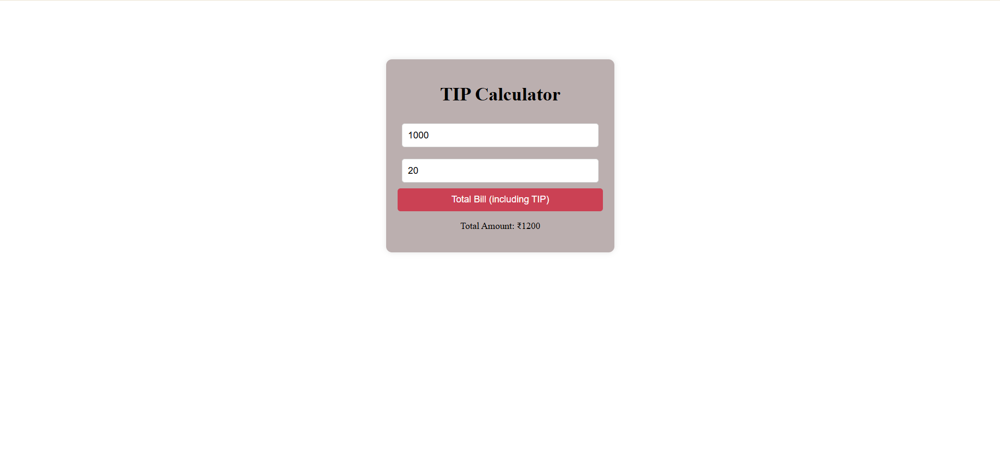 |  
| 🗳️ [Voter Eligibility Checker](./VoterEligibility) | Check **eligibility to vote** | 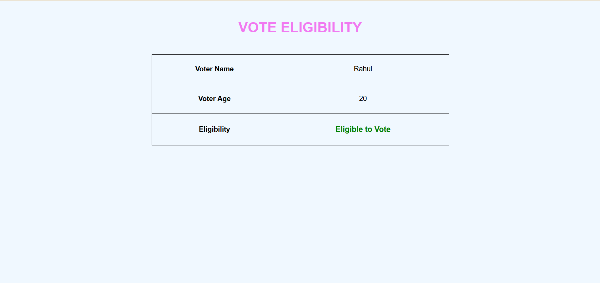 |  


---

## 💻 Technologies Used  
- **HTML5** → Structure  
- **CSS3** → Styling  
- **JavaScript (ES6)** → Logic  

---

## 🛠️ Installation  

### Prerequisites  
- Any modern web browser  
- A text/code editor (VS Code recommended)  

### Steps  
```bash
# Clone the repository
git clone https://github.com/AbhilashMaguluri/JavaScript-mini-projects.git

# Navigate to the project folder
cd JavaScript-mini-projects
```
---
## 🚀 Usage  

1. Open any project folder (e.g., `AgeCalculator`)  
2. Double-click the `.html` file OR open it in your browser  
3. Interact with the project 🚀  

---

## 📁 Project Structure

JavaScript-mini-projects/
├── 📂 AgeCalculator/
│   ├── AgeCalculator.html
│   ├── AgeCalculator.css
│   ├── AgeCalculator.js
│   ├── AgeCalculator.png
│   └── README.md
├── 📂 AgeDifferenceCalculator/
│   ├── AgeDifferenceCalculator.html
│   ├── AgeDifferenceCalculator.css
│   ├── AgeDifferenceCalculator.js
│   ├── AgeDifferenceCalculator.png
│   ├── AgeDifferenceCalculator2.png
│   └── README.md
├── 📂 ArmstrongNumber/
│   ├── ArmstrongNumber.html
│   ├── ArmstrongNumber.css
│   ├── ArmstrongNumber.js
│   ├── ArmstrongNumber.png
│   └── README.md
├── 📂 BMIcalculator/
│   ├── BMI.html
│   ├── BMI.css
│   ├── BMI.js
│   ├── BMI.png
│   └── README.md
├── 📂 Calender/
│   ├── Calender.html
│   ├── Calender.css
│   ├── Calender.js
│   ├── Calendar.png
│   └── README.md
├── 📂 Denominations/
│   ├── Denominations.html
│   ├── Denominations.css
│   ├── Denominations.js
│   ├── Denominations.png
│   └── README.md
├── 📂 DigitalClock/
│   ├── DigitalClock.html
│   ├── DigitalClock.css
│   ├── DigitalClock.js
│   ├── DigitalClock.png
│   └── README.md
├── 📂 DistanceConverter/
│   ├── DistanceConverter.html
│   ├── DistanceConverter.css
│   ├── DistanceConverter.js
│   ├── DistanceConverter.png
│   └── README.md
├── 📂 Factorial/
│   ├── Factorial.html
│   ├── Factorial.css
│   ├── Factorial.js
│   ├── Factorial.png
│   └── README.md
├── 📂 Fibonacci/
│   ├── Fibonacci.html
│   ├── Fibonacci.css
│   ├── Fibonacci.js
│   ├── FibonaccibyCount.png
│   ├── FibonaccibyLimit.png
│   └── README.md
├── 📂 PalindromeChecker/
│   ├── PalindromeChecker.html
│   ├── PalindromeChecker.css
│   ├── PalindromeChecker.js
│   ├── PalindromeChecker.png
│   └── README.md
├── 📂 PercentageCalculator/
│   ├── PercentageCalculator.html
│   ├── PercentageCalculator.css
│   ├── PercentageCalculator.js
│   ├── PercentageCalculator.png
│   └── README.md
├── 📂 PrimeNumber/
│   ├── PrimeNumber.html
│   ├── PrimeNumber.css
│   ├── PrimeNumber.js
│   ├── CheckPrime.png
│   ├── FirstNPrimes.png
│   ├── PrimesUptoN.png
│   └── README.md
├── 📂 TextAreaCounter/
│   ├── TextAreaCounter.html
│   ├── TextAreaCounter.css
│   ├── TextAreaCounter.js
│   ├── TextAreaCounter.png
│   └── README.md
├── 📂 TipCalculator/
│   ├── TipCalculator.html
│   ├── TipCalculator.css
│   ├── TipCalculator.js
│   ├── TipCalculator.png
│   └── README.md
├── 📂 VoterEligibility/
│   ├── VoterEligibility.html
│   ├── VoterEligibility.css
│   ├── VoterEligibility.js
│   ├── VoterEligibility.png
│   ├── VoterEligibilityAge.png
│   ├── VoterEligibilityName.png
│   └── README.md

---
## 🧪 Testing  

- Test in multiple browsers (**Chrome, Firefox, Edge**)  
- Verify calculators with **manual values**  
- Check edge cases:  
  - Empty inputs  
  - Negative numbers  
  - Large values
---

## 🤝 Contributing  

```bash
# 1) Fork the repo on GitHub (click the Fork button)

# 2) Clone your fork
git clone https://github.com/<your-username>/<repo>.git
cd <repo>

# 3) Create a feature branch
git checkout -b feature/<branch-name>

# 4) Stage & commit changes
git add -A
git commit -m "Add <short-description>"

# 5) Push to your fork
git push -u origin feature/<branch-name>
```
Open a Pull Request 🎉

---

## 👨‍💻 Author  
[**Abhilash Maguluri**](https://github.com/AbhilashMaguluri)  
💡 Passionate about **building and solving**  
🚀 Always exploring new ways to learn and innovate  
- 💼 LinkedIn: [Abhilash Maguluri](https://linkedin.com/in/abhilashmaguluri)  


 
 
