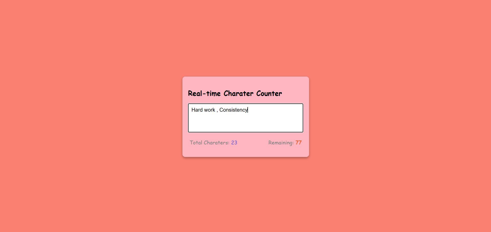

# ✍️ Real-time Character Counter  

A simple and interactive **Character Counter** built with **HTML, CSS, and JavaScript**.  
Type your text in the box and instantly see the **total characters typed** and the **remaining characters allowed** (based on a maximum limit).  

  
  
  

---

## 📑 Table of Contents  
- [Features](#-features)  
- [How It Works](#-how-it-works)  
- [Project Structure](#-project-structure)  
- [Demo Screenshot](#-demo-screenshot)  
- [Technologies Used](#-technologies-used)  
- [Installation / How to Run Locally](#-installation--how-to-run-locally)  

---

## ✨ Features  
- Real-time character counting  
- Displays both **total characters typed** and **remaining characters**  
- Clean and responsive interface  
- Prevents typing beyond the maximum limit  

---

## 🛠 How It Works  
1. Start typing text inside the textarea.  
2. The app will instantly show:  
   - **Total Characters:** How many characters have been typed.  
   - **Remaining Characters:** How many characters you can still type (based on the set `maxlength`).  
3. Once you reach the maximum limit, typing stops automatically.  

---

## 📂 Project Structure  
```

TextAreaCounter/
│── TexrAreaCounter.html # Main HTML file
│── TexrAreaCounter.css # Styling
│── TexrAreaCounter.js # Counter logic
│── TexrAreaCounter.png # Demo screenshot
│── README.md # Project documentation

```


---

## 📸 Demo Screenshot  
Here is a screenshot of the project running in the browser:  

  


---

## 💻 Technologies Used  
- **HTML5** → Structure of the app  
- **CSS3** → Styling and layout  
- **JavaScript (ES6)** → Real-time character counting logic  

---

## 🚀 Installation / How to Run Locally  
To run this project locally:  

```bash
# Clone the repository
git clone https://github.com/your-username/TextAreaCounter.git  

# Open the project folder
cd TextAreaCounter  

# Run in your browser
open TexrAreaCounter.html  
# Or simply double-click TexrAreaCounter.html to open it in your browser
