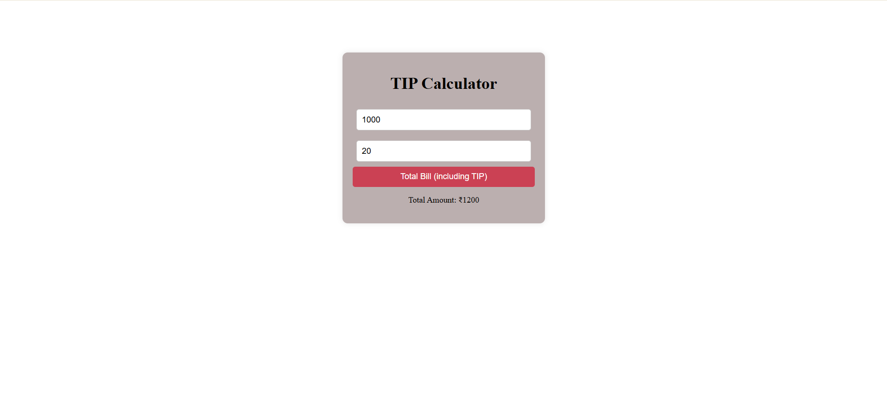

# 💰 Tip Calculator  

A simple and interactive **Tip Calculator** built with **HTML, CSS, and JavaScript**.  
Enter the **bill amount** and a **tip percentage**, and instantly get the **total bill including the tip**.  

  
  
  

---

## 📑 Table of Contents  
- [Features](#-features)  
- [How It Works](#-how-it-works)  
- [Project Structure](#-project-structure)  
- [Demo Screenshot](#-demo-screenshot)  
- [Technologies Used](#-technologies-used)  
- [Installation / How to Run Locally](#-installation--how-to-run-locally)  

---

## ✨ Features  
- Clean and user-friendly interface  
- Calculates total bill with tip instantly  
- Handles invalid inputs gracefully  
- Works directly in the browser  

---

## 🛠 How It Works  
1. Enter the **Bill Amount** in the first input field.  
2. Enter the **Tip Percentage** in the second input field.  
3. Click the **"Total Bill (including TIP)"** button.  
4. The app will display the **final bill including the tip**.  

---

## 📂 Project Structure  
```
TipCalculator/
│── TipCalculator.html # Main HTML file
│── TipCalculator.css # Styling
│── TipCalculator.js # Tip calculation logic
│── TipCalculator.png # Demo screenshot
│── README.md # Project documentation

```

---

## 📸 Demo Screenshot  
Here is a screenshot of the project running in the browser:  

  


---

## 💻 Technologies Used  
- **HTML5** → Structure of the app  
- **CSS3** → Styling and design  
- **JavaScript (ES6)** → Logic for tip calculation  

---

## 🚀 Installation / How to Run Locally  
To run this project locally:  

```bash
# Clone the repository
git clone https://github.com/your-username/TipCalculator.git  

# Open the project folder
cd TipCalculator  

# Run in your browser
open TipCalculator.html  
# Or simply double-click TipCalculator.html to open it in your browser
