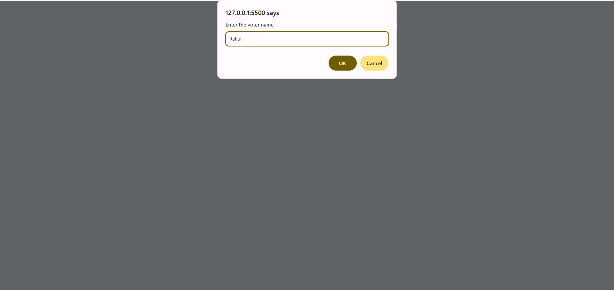

# 🗳️ Voter Eligibility Checker  

A simple and interactive **Voter Eligibility Checker** built with **HTML, CSS, and JavaScript**.  
Enter the **voter's name** and **age**, and instantly know whether the person is **eligible to vote** or not.  

  
  
  

---

## 📑 Table of Contents  
- [Features](#-features)  
- [How It Works](#-how-it-works)  
- [Project Structure](#-project-structure)  
- [Demo Screenshot](#-demo-screenshot)  
- [Technologies Used](#-technologies-used)  
- [Installation / How to Run Locally](#-installation--how-to-run-locally)  

---

## ✨ Features  
- Input voter name and age  
- Displays eligibility result in a clear table  
- Handles invalid inputs gracefully  
- Dynamic result with **color indicators**:  
  - ✅ Green → Eligible  
  - ❌ Red → Not Eligible  
  - ⚠️ Red → Invalid Input  

---

## 🛠 How It Works  
1. Enter the **Voter’s Name** (via prompt).  
2. Enter the **Voter’s Age** (via prompt).  
3. The page will display:  
   - Name  
   - Age (or "Invalid Age")  
   - Eligibility status  

---

## 📂 Project Structure  
```

VoterEligibility/
│── index.html # Main HTML file
│── VoterEligibility.css # Styling
│── VoterEligibility.js # Voting eligibility logic
│── VoterEligibility.png # Demo screenshot
│── VoterEligibilityName.png # Demo screenshot
│── VoterEligibilityAge.png # Demo screenshot
│── README.md # Project documentation

```

---

## 📸 Demo Screenshot  
Here is a screenshot of the project running in the browser:  

  
  
  

---

## 💻 Technologies Used  
- **HTML5** → Structure of the app  
- **CSS3** → Styling and design  
- **JavaScript (ES6)** → Logic for eligibility checking  

---

## 🚀 Installation / How to Run Locally  
To run this project locally:  

```bash
# Clone the repository
git clone https://github.com/your-username/VoterEligibility.git 

# Open the project folder
cd VoterEligibility  

# Run in your browser
open index.html  
# Or simply double-click index.html to open it in your browser
